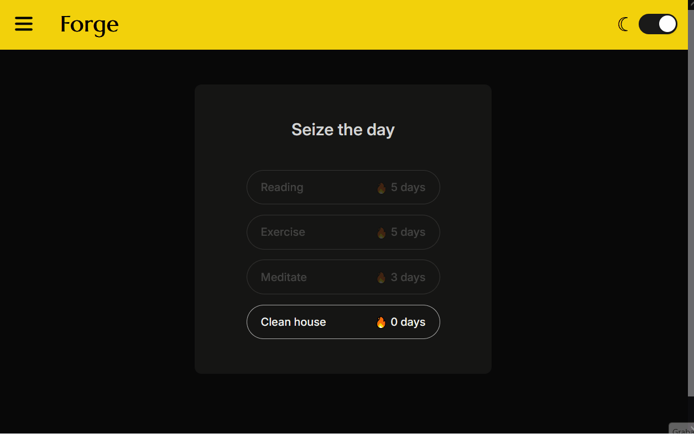

# Forge

A minimalist daily habit-building app focused on clarity, simplicity, and real progress.
Forge helps you track your habits, maintain streaks, and view your history — all stored locally using IndexedDB.

&nbsp;
## Demo

Below are short demos showcasing core functionality:

### Core workflow:

- Create a habit
- Complete it
- Edit it
- Delete it

&nbsp;
### Calendar & streaks:

- Multiple habits support
- Daily completions
- History per habit

&nbsp;
## Features
- Add / edit / delete habits
- Mark habits as completed once per day
- Automatic daily streak tracking
- Visual history through a calendar view
- Toast feedback (sonner)
- Lightweight particle animations (tsparticles)

&nbsp;
## Stack
- React + Vite
- IndexedDB (local persistence)
- React-router
- Sonner (toast notifications)
- CSS

&nbsp;
## What I learned
- Persisting data locally using IndexedDB
- Structuring routes and views with react-router
- Handling state and UI logic cleanly
- Designing a daily streak system and calendar history
- Integrating animations without compromising UX

&nbsp;
## How to run

### Pre-requisites
- Node.js (v22)
- npm

### Installation
```bash
git clone https://github.com/felipe-u/Forge.git
cd forge
npm install
```

### Run
```bash
npm run dev
```

&nbsp;
## Status
Version 1 - stable and functional
